# HHA504_assignment_cloudcosts
Assignment: Exploring Cost Management and Billing on Azure and GCP

# Objective
The objective of this assignment is to introduce you to the cost management and billing interfaces of Azure and Google Cloud Platform (GCP). By the end of this assignment, you will be able to navigate these platforms to understand how cloud costs are tracked and managed.

# Instructions
## 1. Explore the Cost Management Dashboards
Azure:
Navigate to the Azure Cost Management and Billing service.
Take a tour of the dashboard to familiarize yourself with the available tools and reports.
Identify where you would monitor costs and set budgets or alerts.
GCP:
Access the Google Cloud Console and go to the Billing section.
Explore the Billing Overview and Reports sections to understand how GCP presents cost data.
## 2. Set Up a Hypothetical Budget
Azure:
Create a budget for a hypothetical monthly spend (e.g., $8).
Set up a notification to alert you when your hypothetical spending reaches 80% of the budget.
GCP:
Create a budget in GCP for the same hypothetical amount ($8).
Set up a notification to alert you when your costs approach the budget limit.
## 3. Investigate Cost Management Features
Azure:
Review the available options for forecasting future costs based on your budget.
Explore the cost-saving recommendations provided by Azure Advisor (even if no data is present, you can see where these recommendations would appear).
GCP:
Explore the "Cost Breakdown" and "Budgets & alerts" features to see how GCP allows you to track and manage your costs.
Investigate the "Recommendations" section under GCP Billing to understand potential cost-saving suggestions (if any are provided based on the budget).
## 4. Submit Your Work
Create a Markdown document summarizing your exploration of the cost management features in both Azure and GCP.
Include the following in your document:
Screenshots of the dashboards you explored.
Screenshots showing the setup of your hypothetical budgets and alerts.
A brief explanation of the cost management features you found most interesting or useful.
Commit and push this Markdown document, along with the screenshots, to your GitHub repository.

# Cloud Cost Management Exploration: Azure and GCP
This document summarizes the exploration of the cost management and billing interfaces for Microsoft Azure and Google Cloud Platform (GCP), focusing on cost tracking, budget setup, and cost-saving features.

## AZURE SCREEN SHOTS

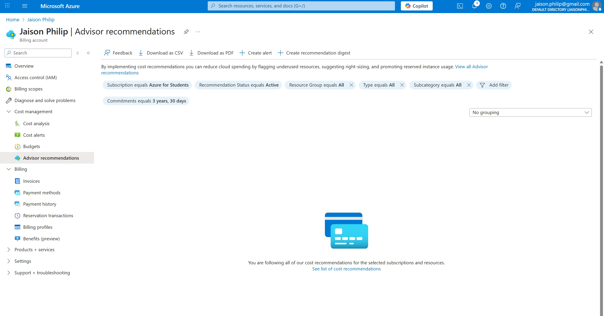

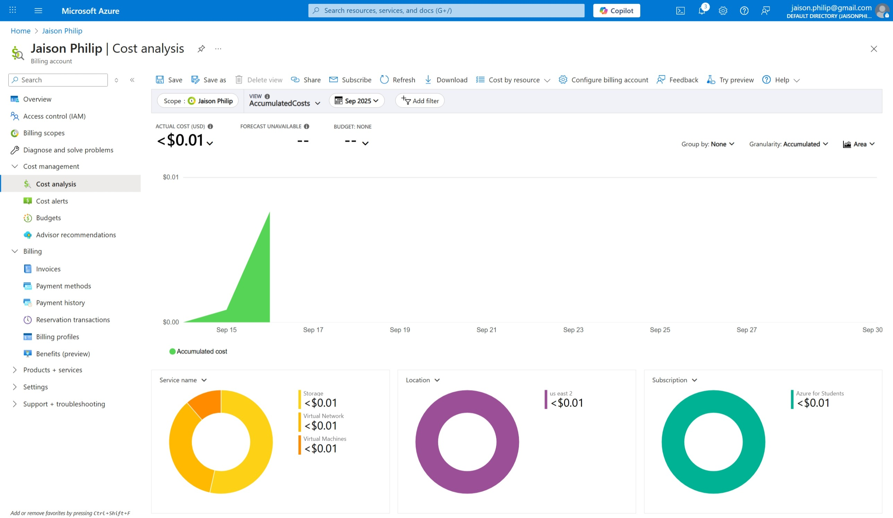

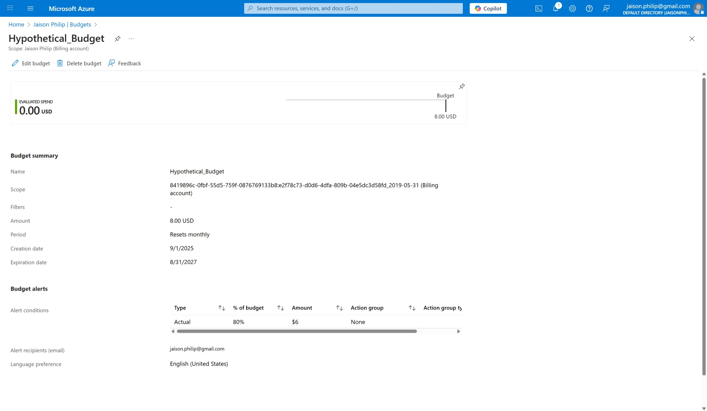

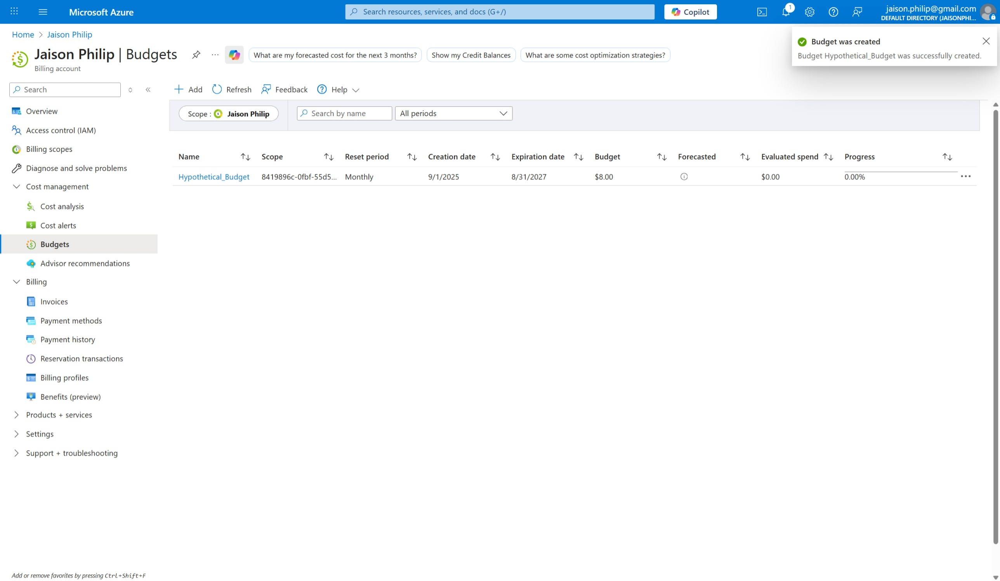

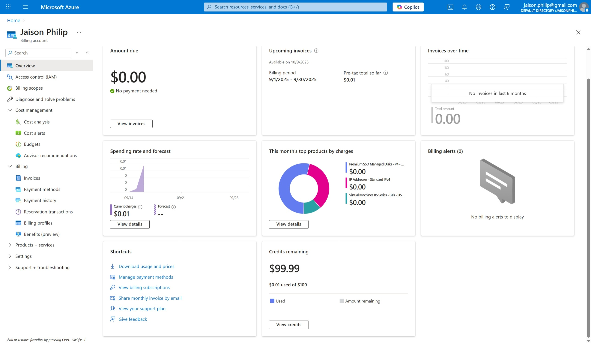

## GCP SCREEN SHOTS

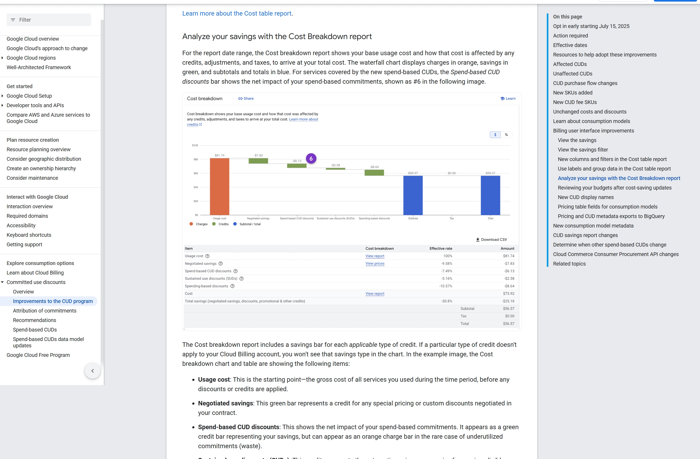

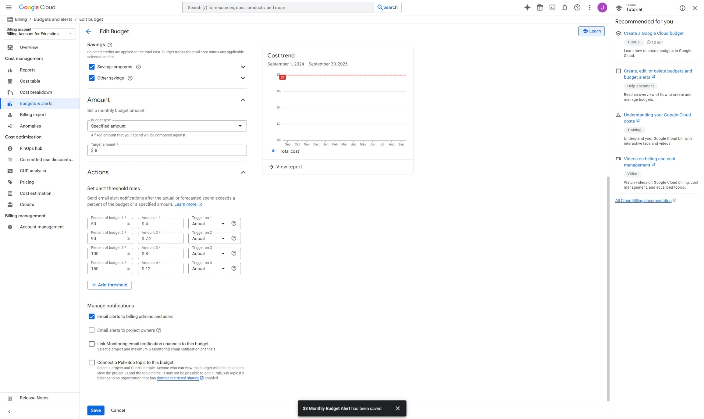

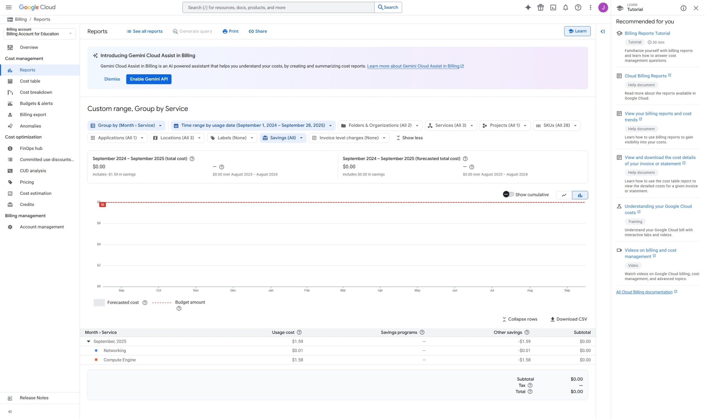

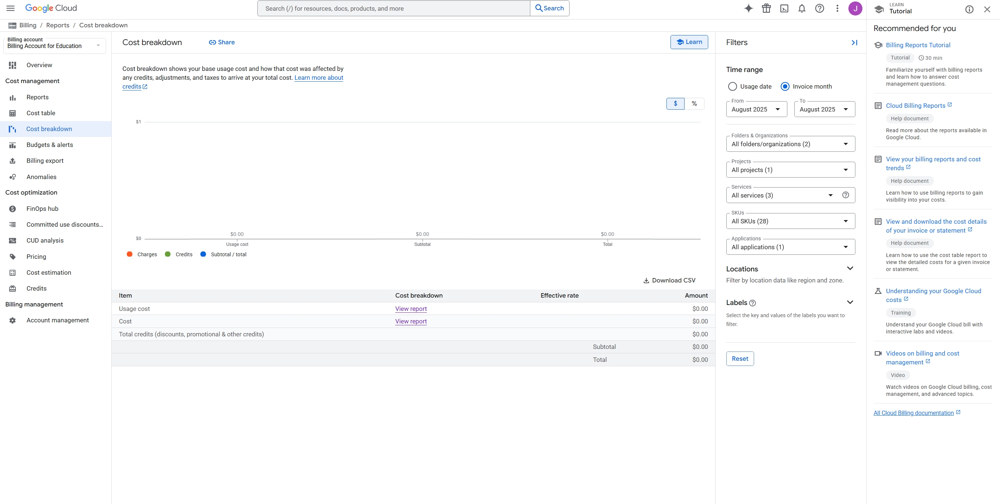

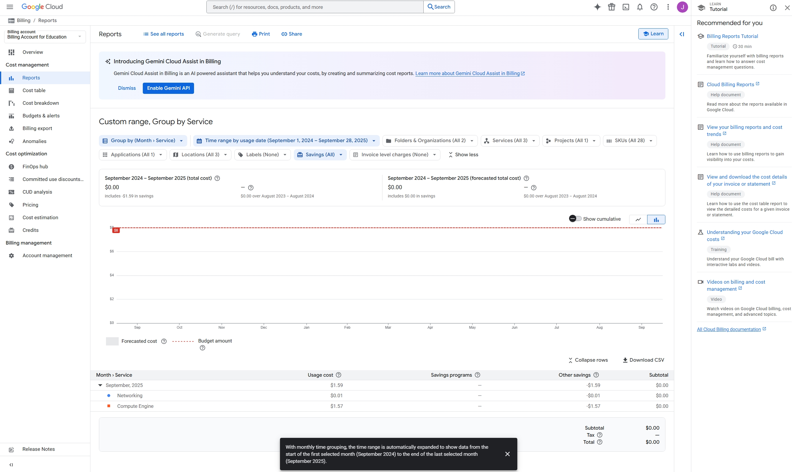

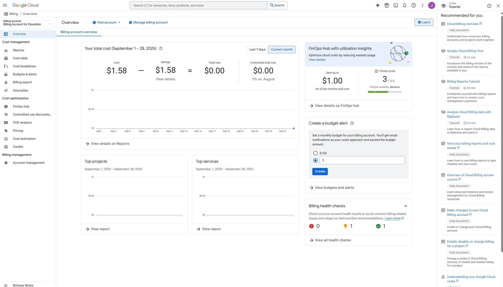

1. Cost Management Dashboards Overview
# Google Cloud Platform (GCP)
The GCP Billing section provides detailed views under Reports, Cost breakdown, and Budgets & alerts.

# Reports: 
Allows for custom range reporting, grouping data by criteria like Service, Time range, and SKUs. The dashboard provides a visual graph of usage and a breakdown table, which in the screenshots shows minimal usage for Networking and Compute Engine. It also displays Forecasted cost.

# Cost Breakdown:
 Shows the base usage cost and how credits, adjustments, and taxes affect the total cost. This report explicitly details items like Usage cost and Total credit(discounts, promotional & other credits).

# Navigation:
 All billing-related tools are easily accessible from the side menu under the Billing account section.

# Microsoft Azure
The Azure interface under Cost Management features Cost analysis and Advisor recommendations.

# Cost Analysis:
 Provides a graphical view of AccumulatedCosts over time and pie charts breaking down costs by Service name (e.g., Storage, Virtual Machines), Location, and Subscription. This provides a quick visualization of where spending is occurring.

# Advisor recommendations:
 This is the dedicated area where Azure provides suggestions for optimizing costs, even if no active recommendations are displayed. The dashboard shows filters for commitment terms (e.g., Commitments equals 3 years, 30 days) and recommendation status.

2. Hypothetical Budget Setup and Alerts
Both platforms offer features to set monthly budgets and notifications to prevent unexpected overspending.

# GCP Budget Setup
A budget was set up for a hypothetical monthly spend of $8.

Budget Type: Specified amount.

Target Amount: $8.

# Alerts (Action Thresholds): 
Notifications were configured to trigger at multiple percentages of the budget, tracking the Actual spend:

50% of budget ($4)
90% of budget ($7.2)
100% of budget ($8)
150% of budget ($12)

# Azure Budget Setup (Hypothetical Alert)
The assignment instructed to create a budget of $8 with an alert at 80% of the budget. While the exact budget creation screen wasn't captured, the goal was to set up a notification that would trigger when the spending reached $6.40 (80% of $8). Azure's Cost Management interface allows for this level of granularity in budget and alert configuration.

3. Investigated Cost Management Features

## GCP	Cost Breakdown Report
	This report is highly useful for its clarity in separating Usage cost from all forms of Credits (discounts, promotional). It provides a transparent view of the gross charge versus the final effective cost, which is crucial for understanding the real value of CUDs (Committed Use Discounts) and promotions.
## GCP	Budgets & Alerts with Multiple Thresholds
	The ability to set multiple alert thresholds (e.g., 50%, 90%, 150%) on a single budget is very effective. It allows for proactive warning (50%), critical alert (90-100%), and post-breach notification (150%) all in one configuration, facilitating timely intervention to manage spending.
## Azure	Cost Analysis Grouping
	The ability to quickly group and visualize costs by key dimensions like Service name, Location, and Subscription using interactive pie charts is powerful. This graphical breakdown immediately highlights the major cost drivers and regions of spending.
## Azure	Advisor Recommendations
	Azure Advisor's role in providing automated, contextual cost-saving suggestions is a critical proactive feature. Even when no recommendations are present, the interface shows where to look for suggested actions like right-sizing or utilizing reserved instances to reduce cloud spend.